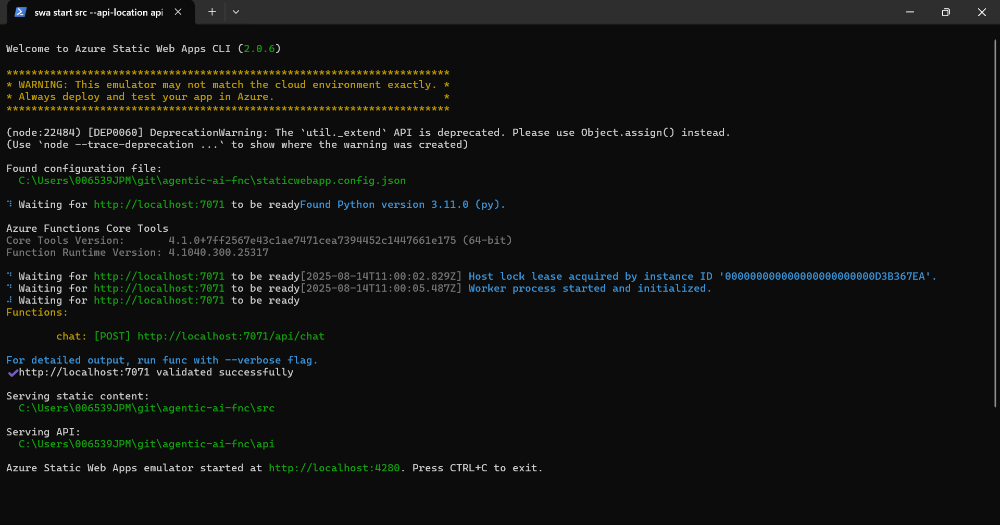
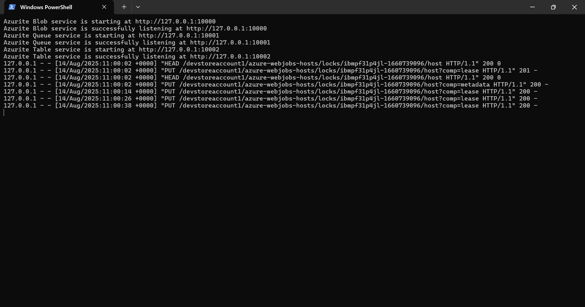

# プロジェクト技術スタック概要

このプロジェクトは **Azure Static Web Apps** を中心に、  
フロントエンドとバックエンド（Azure Functions）を統合して動作する  
AIチャットアプリケーションです。  
最小構成ではGemini API（Google Generative AI）を利用しています。

---

## 1. フロントエンド

- **技術**: HTML / CSS / JavaScript
- **役割**:  
  - ユーザーの入力フォーム表示  
  - API（Azure Functions経由）へのリクエスト送信  
  - Gemini APIの応答結果を画面に表示
- **開発環境**:
  - VSCode
  - Azure Static Web Apps CLIによるローカル起動

---

## 2. バックエンド（API）

- **技術**: Azure Functions（Python）
- **Pythonバージョン**: 3.11
- **役割**:
  - フロントからのリクエストを受け取りGemini APIへ転送
  - APIキーの秘匿管理（環境変数）
  - Gemini APIのレスポンスをフロントに返す
- **主要ライブラリ**:
  - `azure-functions` … Functions用SDK
  - `google-genai` … Gemini API用SDK

---

## 3. AI連携

- **サービス**: Google Gemini API
- **モデル例**: `gemini-2.0-flash`
- **APIキー管理**:
  - ローカル: `local.settings.json`
  - Azure本番: Azureポータルのアプリケーション設定に保存
- **利用用途**:
  - ユーザーからの質問やメッセージに対して自然言語応答を生成

---

## 4. インフラ構成

- **Azure Static Web Apps（SWA）**
  - Freeプラン利用
  - GitHub Actionsによる自動デプロイ
- **Azure Functions**
  - SWA管理Functions（Managed Functions）
  - HTTPトリガーのみ使用
- **Azure Storage（ローカル開発用）**
  - Azuriteを使用
  - 接続文字列: `UseDevelopmentStorage=true`

---

## 5. ローカル開発ツール

- **Node.js**: v22（npm同梱）
- **npmグローバルインストールツール**:
  - Azure Functions Core Tools（v4）
  - Azure Static Web Apps CLI
  - Azurite
- **Python仮想環境（venv）**
  - プロジェクトごとに作成し、`requirements.txt`で依存管理

<br>
<br>

# セットアップガイド

## アカウント準備

### GitHub

プライベートメールアドレスを使用してGitHubアカウントを作成してください。
アカウント作成ができたらリポジトリ([https://github.com/ai-agent-team/agentic-ai-fnc](https://github.com/ai-agent-team/agentic-ai-fnc))に招待しますので、石田・山崎・花田の誰かへ連絡ください。

### Azure

GitHubアカウントを使用してAzureアカウントを作成してください。
本番環境はAzureにホスティングしますので、開発が進んでいくとAzureアカウントが必要になります。
すぐには必要ありませんが、時間のある時に作成をお願いします。

## ローカル環境構築

### PowerShellのインストール

PowerShellのバージョンには5系と7系がありますが、このプロジェクトでは7系を使用しています。以下手順でバージョンを調べ、端末に5系しか入っていない場合は7系をインストールしてください。

1. スタートメニューから「PowerShell」を検索し、7系が存在するかどうか確認してください。7系が存在した場合はここで終了となります。<br>
7系<br>
<br>
5系<br>
<br>
2. PowerShell(5系でよい)を「管理者として実行」し、以下コマンドを実行してください。
```PowerShell
winget install --id Microsoft.PowerShell --source winget
```
3. 端末を再起動してください。

### VSCodeのインストール

1. 確かw3のappsからインストールできます。
2. VSCodeを開き、`Ctrl+Shift+X` の拡張機能から、「PowerShell」を検索してインストールしてください。

### リポジトリのクローン

「SSHでGitリポジトリをクローンする方法」などで調べてください。

### 言語・ライブラリの導入

1. VSCodeを「管理者として実行」で起動してください。
2. [agentic-ai-fnc/script/setup.ps1](./script/setup.ps1)を開いてください。
3. 画面右上の▷(Run)で実行してください。
4. エラーが出て原因がわからない場合は、石田・山崎・花田の誰かへ連絡ください。

## ローカルサーバー起動

1. VSCodeを開いてください。(「管理者として実行」でなくても構いません)
2. [agentic-ai-fnc/script/run.ps1](./script/run.ps1)を開いてください。
3. 画面右上の▷(Run)で実行してください。
4. Azure Static Web App CLI(SWA)とAzuriteの2つのウィンドウが開きます。
5. 以下のような状態になったら起動が成功しています。
<br>
SWA<br>
<br>
Azurite<br>
<br>

6. [http://localhost:4280/](http://localhost:4280/)をブラウザで開き、チャットが行えることを確認してください。
7. 停止するには各サーバーのウィンドウで`Ctrl+C`を押してください。
